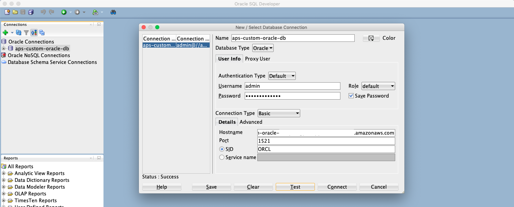
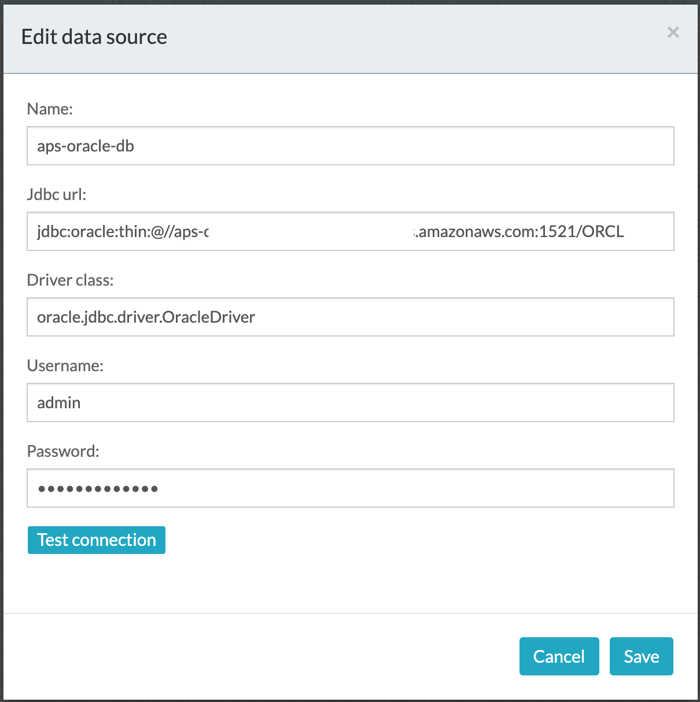
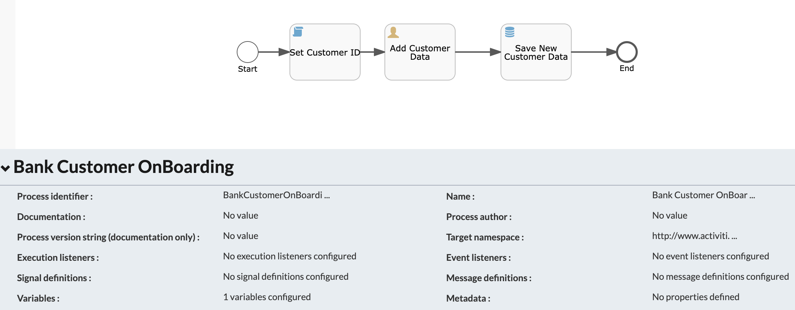
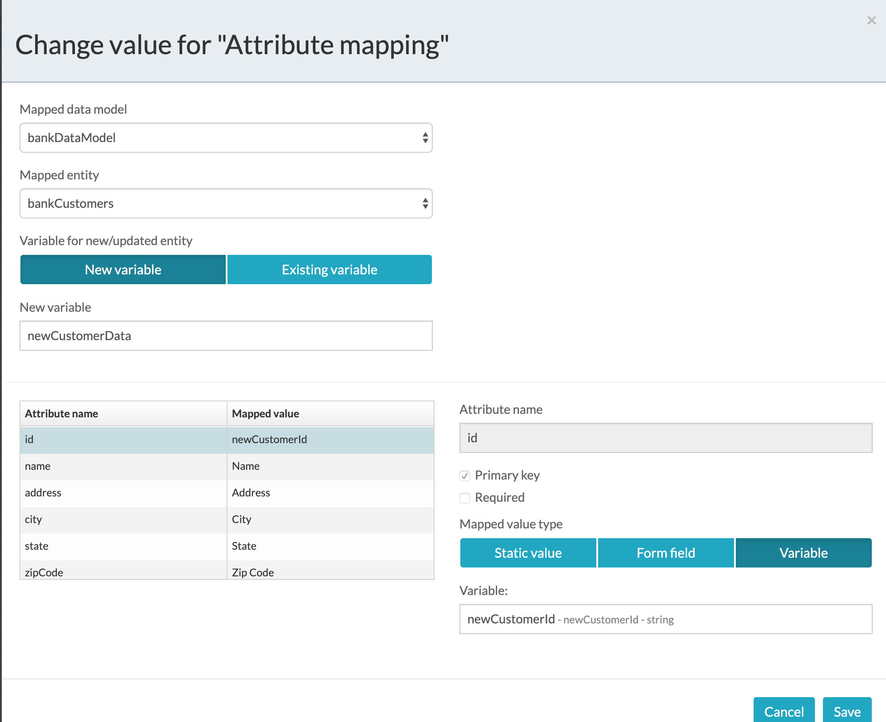
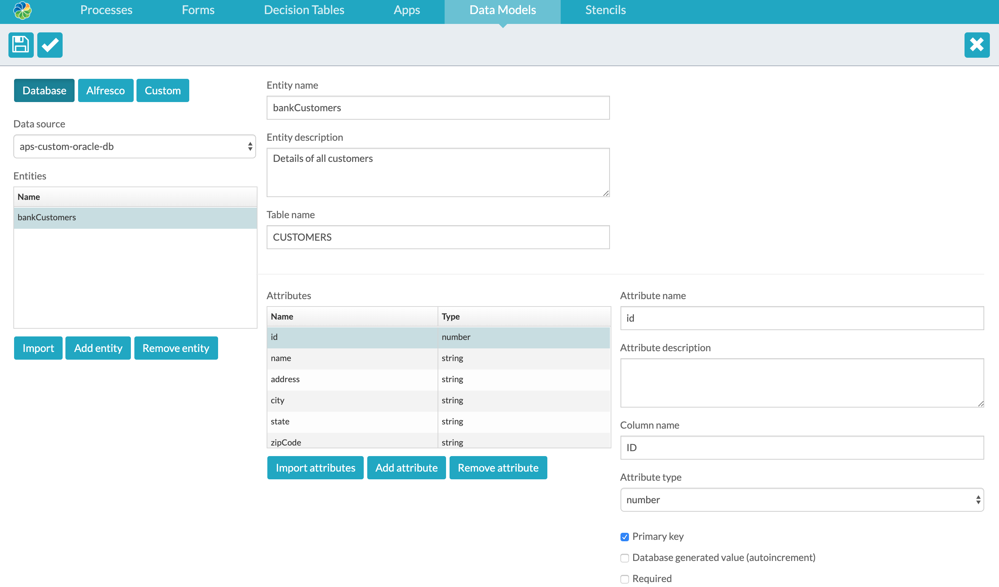
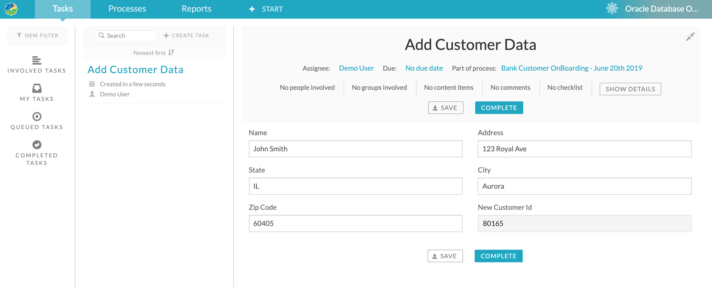
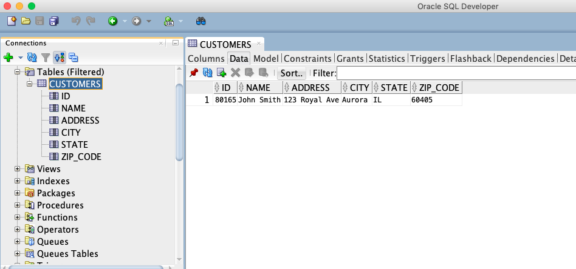

#### The project contains all the components required to create an integration to an Enterprise System Of Records (AWS Oracle RDS)

### Use-Case / Requirement
Build a process to create an integration to Oracle Database that serves the purpose of [Enterprise System Of Records](https://en.wikipedia.org/wiki/System_of_record).

### Prerequisites to run this demo end-2-end

* Alfresco Process Services (powered by Activiti) (Version 1.9 and above) - If you don't have it already, you can download a 30 day trial from [Alfresco Process Services (APS)](https://www.alfresco.com/products/business-process-management/alfresco-activiti).Instructions & help available at [Activiti Docs](http://docs.alfresco.com/activiti/docs/), [Alfresco BPM Community](https://community.alfresco.com/community/bpm)
* The Oracle Database is created as AWS RDS.

## Configuration Steps

### Create the AWS RDS Oracle DB
Follow the steps per [AWS Documentation](https://docs.aws.amazon.com/AmazonRDS/latest/UserGuide/CHAP_GettingStarted.CreatingConnecting.Oracle.html) to create an [AWS Oracle RDS](https://aws.amazon.com/rds/oracle/)

### Connect to the AWS RDS Oracle DB using SQL Developer

### Create datasource for AWS RDS Oracle DB in APS
1. Download the ojdbc7.jar file from [Oracle site](http://www.oracle.com/technetwork/database/features/jdbc/jdbc-drivers-12c-download-1958347.html)
2. Copy the ojdbc7.jar to tomcat/lib location of APS server. eg: /usr/share/tomcat/lib/ojdbc7.jar
3. Restart APS
4. Create data source using the values mentioned in [APS article](https://github.com/sherrymax/aps-examples/tree/master/aps-custom-database-integration#oracle)
5. Name : aps-custom-oracle-db
6. JDBC URL : jdbc:oracle:thin:@//<i>end-point</i>:<i>port-number</i>/ORCL
7. Driver Class : oracle.jdbc.driver.OracleDriver
8. User Name : <i>db-username</i>
9. Password : <i>db-password</i>
   

### Activiti Setup and Process Deployment
1. Import the [Oracle-Database-Operations.zip](Oracle-Database-Operations.zip) app available in this project into Activiti.
2. Process Flow.  
3. Data Model Configuration in Process. 
4. Data Model Configuration in Application.   
5. Publish/Deploy the APS App.

### Run the DEMO
1. Verify the data entered through the APS form: 
1. Verify the data in AWS RDS Oracle Database using SQL Developer: 

### References
1. http://docs.alfresco.com/activiti/docs/user-guide/1.5.0/
2. http://docs.alfresco.com/activiti/docs/user-guide/1.5.0/#_connecting_your_data_model_to_a_relational_database
3. https://oskar.idashboards.com/hc/en-us/articles/227499107-Amazon-RDS-Oracle-Data-Source
4. https://medium.com/skillhive/spring-boot-spring-data-jpa-and-oracle-database-c4af89f727e0
5. https://docs.aws.amazon.com/AmazonRDS/latest/UserGuide/CHAP_GettingStarted.CreatingConnecting.Oracle.html
